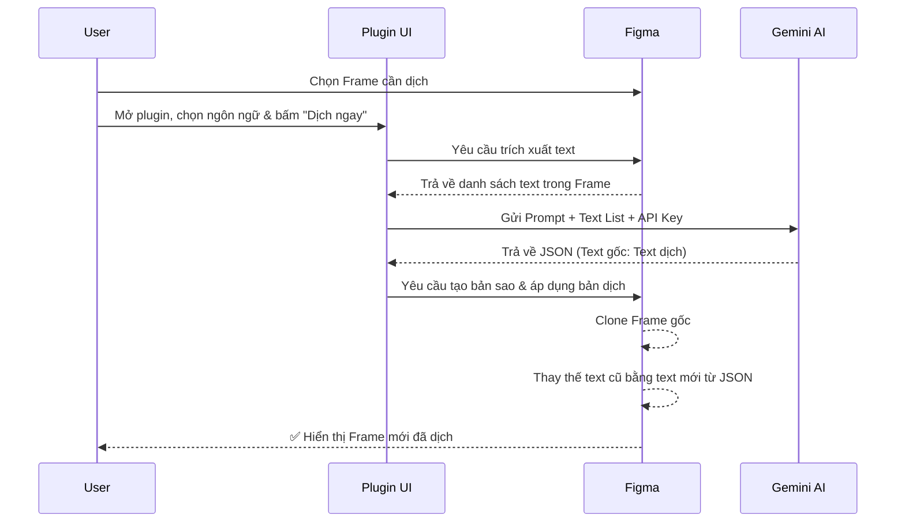

# 🌐 Figma Localization Tool

Plugin Figma giúp dịch text UI sang bất kỳ ngôn ngữ nào bằng **Google Gemini AI**. Chọn frame, chọn ngôn ngữ, bấm dịch — xong trong vài giây.

---

## ✨ Tính năng

- 🤖 **Dịch bằng AI** — Sử dụng Google Gemini để dịch tự nhiên, đúng ngữ cảnh UI
- 🌍 **13+ ngôn ngữ có sẵn** — Việt, Nhật, Hàn, Trung, Thái, Tây Ban Nha, Pháp, Đức, Bồ Đào Nha, Nga, Ả Rập, Hindi, Indonesia + tự nhập mã ISO
- 📋 **Tự động trích xuất text** — Quét toàn bộ text layer trong frame được chọn
- 🖼️ **Không phá bản gốc** — Tạo bản sao đã dịch, giữ nguyên frame gốc
- ⚡ **Chọn model AI** — Tự do chọn model Gemini (Flash, Pro, v.v.)
- ✏️ **Tuỳ chỉnh prompt** — Điều chỉnh giọng văn, độ dài, phong cách dịch
- 💾 **Lưu cài đặt** — API key, model, prompt được lưu tự động trên máy

---

## 🔑 Hướng dẫn lấy API Key từ Google AI Studio

Bạn cần một API key **miễn phí** từ Google để sử dụng plugin.

### Các bước:

1. Truy cập **[Google AI Studio](https://aistudio.google.com/apikey)**

2. Đăng nhập bằng **tài khoản Google** của bạn

3. Nhấn nút **"Create API Key"** (Tạo API Key)

4. Chọn một Google Cloud project (hoặc tạo mới — miễn phí)

5. **Sao chép API key** — key có dạng: `AIzaSy...xxxxx`

6. **Dán vào** ô **🔑 API Key** trong plugin

> **💡 Mẹo:**
> - Bản miễn phí cho phép gọi API khá nhiều mỗi ngày — đủ dùng cho hầu hết các tác vụ dịch
> - API key được lưu **trên máy bạn** qua `clientStorage` của Figma — không gửi lên bất kỳ server nào khác
> - Giữ API key bí mật — không chia sẻ công khai

---

## 📦 Cài đặt vào Figma

1. Mở **Figma Desktop App** (bản cài trên máy tính)
2. Vào **Menu (☰)** → **Plugins** → **Development** → **Import plugin from manifest...**
3. Tìm đến thư mục project, chọn file `manifest.json`
4. Plugin sẽ xuất hiện trong **Plugins → Development**

---

## 🚀 Hướng dẫn sử dụng

### Quy trình hoạt động (Workflow)
Dưới đây là sơ đồ trực quan hóa quá trình plugin hoạt động:



### Bước 1: Mở plugin
- Click phải vào canvas → **Plugins** → **Development** → **Localization Tool**

### Bước 2: Cài đặt lần đầu
- Dán **API key** từ Google AI Studio vào ô 🔑
- Nhấn **🔄 Tải model** để tải danh sách model Gemini có sẵn
- Chọn model muốn dùng (mặc định: `gemini-2.5-flash`)

### Bước 3: Dịch
1. **Chọn 1 Frame** trên canvas Figma (màn hình muốn dịch)
2. **Chọn ngôn ngữ đích** từ dropdown (hoặc nhập mã ISO tuỳ ý)
3. Nhấn **🚀 Dịch ngay**
4. Đợi vài giây — plugin sẽ tự động hoàn thành các bước còn lại.
5. ✅ Frame mới xuất hiện bên dưới frame gốc với nội dung đã dịch!

### Ví dụ kết quả:
```
Frame gốc:     "Home Screen"
Frame đã dịch: "Home Screen (Tiếng Việt)"
```

---

## 🧪 Hướng dẫn kiểm thử (Testing)

Dự án này sử dụng **Jest** để viết Unit Test cho các hàm tiện ích (`utils.ts`).
Các bài kiểm thử đảm bảo logic xử lý văn bản như hàm `normalize` chạy đúng để việc tìm kiếm và thay thế text chính xác hơn.

### Cài đặt môi trường kiểm thử
Đảm bảo bạn đã cài đặt đủ các dependency:
```bash
npm install
```

### Chạy các bài test
Để chạy tất cả các bài test trong dự án:
```bash
npm run test
```

Kết quả sẽ hiển thị chi tiết các test case đã pass.

---

## ✏️ Tuỳ chỉnh Prompt

Bạn có thể tuỳ chỉnh prompt dịch bằng cách nhấn **Hiện/Ẩn** bên cạnh mục Prompt.

### Các biến tự động thay thế:
| Biến | Mô tả |
|------|-------|
| `{{TEXT_LIST}}` | Danh sách text trích từ Figma **(bắt buộc)** |
| `{{LANG_NAME}}` | Tên ngôn ngữ đầy đủ (vd: Tiếng Việt, Tiếng Nhật) |
| `{{LANG_CODE}}` | Mã ISO ngôn ngữ (vd: vi, ja, ko) |

### Ví dụ tuỳ chỉnh:
- *"Giữ nguyên tên riêng, brand name"*
- *"Dùng giọng trang trọng"* hoặc *"giọng thân mật"*
- *"Mỗi bản dịch tối đa 15 ký tự"* (khi UI hẹp)
- *"Nếu là thuật ngữ kỹ thuật phổ biến thì giữ tiếng Anh"*

---

## ⚠️ Lưu ý bảo mật

- **API key** được lưu trên máy bạn qua `clientStorage` của Figma — **không bao giờ** gửi lên server nào khác ngoài Google Gemini API
- **Quyền truy cập mạng** bị giới hạn chỉ cho domain `generativelanguage.googleapis.com`
- **Không theo dõi, không analytics** — plugin hoạt động hoàn toàn offline ngoại trừ lúc gọi API dịch

---

## 📄 Giấy phép

MIT License — xem file [LICENSE](LICENSE) để biết chi tiết.